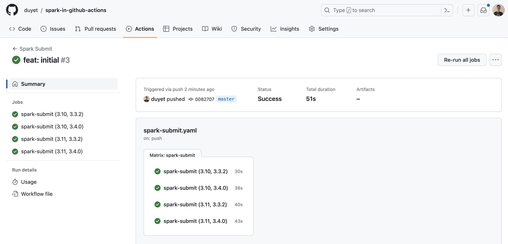

# Run Spark in Github Actions

[](https://github.com/duyet/spark-in-github-actions/actions/workflows/spark-submit.yaml)

This repository provides an example of how to run Apache Spark in GitHub Actions for testing purposes.
We have included a PySpark script `app.py` that can be submitted to Spark using the `spark-submit app.py <input>` command.

```python
import sys

from pyspark.sql import SparkSession

if __name__ == "__main__":
    if len(sys.argv) != 2:
        print("Usage: spark-submit app.py <input>")
        sys.exit(1)

    # TODO: Add argument parser
    input_file_path = sys.argv[1]

    spark = SparkSession.builder.appName("Spark").getOrCreate()
    df = spark.read.json(input_file_path)

    # Show example
    df.show(20)

    df.createOrReplaceTempView("df")

    # Queries
    spark.sql("SELECT * FROM df LIMIT 10").show()
    spark.sql("SELECT COUNT(*) FROM df").show()
    spark.sql("SELECT cn, COUNT(*) FROM df GROUP BY cn ORDER BY 2 DESC").show()
    spark.sql("SELECT cn, MAX(temp) AS max_temp FROM df GROUP BY cn ORDER BY 2 DESC").show()
```

To run Spark in GitHub Actions, we have provided a workflow file named [`spark-submit.yaml`] in the `.github/workflows/` directory. This workflow file defines the steps that GitHub Actions should take to run a PySpark script using the `spark-submit` command.

The [`spark-submit.yaml`] file also specifies the matrix strategy to test the PySpark script on multiple versions of Python and Spark. In this example, the PySpark script will be tested on:

- Python 3.10, Spark 3.3.2.
- Python 3.10, Spark 3.4.0.
- Python 3.11, Spark 3.3.2.
- Python 3.11, Spark 3.4.0.



Here is the result detail for each runs:


**See the Github Actions runs: <https://github.com/duyet/spark-in-github-actions/actions>**

[`spark-submit.yaml`]: .github/workflows/spark-submit.yaml
